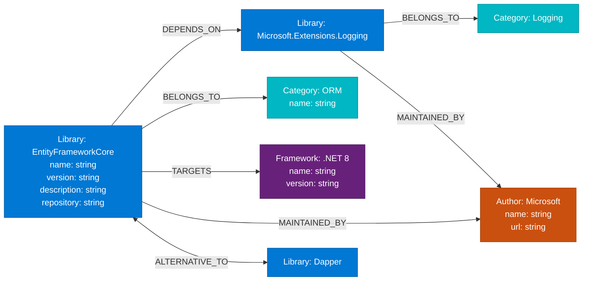

# .NET dependency tool

Interaktywna wizualizacja zależności między bibliotekami .NET z wykorzystaniem grafowej bazy danych.

## Technologie

- **Frontend**: Next.js 14, React, TypeScript
- **Backend**: GraphQL, Apollo Server
- **Baza danych**: Neo4j AuraDB
- **Wizualizacja**: vis-network
- **Deploy**: Vercel

## Struktura projektu

```
projekt/
├── pages/              # Strony aplikacji
│   ├── index.tsx       # Wizualizacja grafu (strona główna)
│   ├── libraries.tsx   # Lista wszystkich bibliotek
│   ├── analytics.tsx   # Algorytmy grafowe (PageRank, analiza zależności)
│   ├── manage-nodes.tsx         # CRUD dla węzłów
│   ├── manage-relationships.tsx # CRUD dla relacji
│   └── api/
│       ├── graphql.ts  # API GraphQL
│       └── analytics.ts # API algorytmów grafowych
├── lib/
│   ├── neo4j.ts        # Połączenie z Neo4j
│   └── graphql/        # Schemat i zapytania GraphQL
└── styles/
    └── globals.css     # Style (VS Code dark theme)
```

## Instalacja lokalna

1. Sklonuj repozytorium i zainstaluj zależności:
```bash
npm install
```

2. Utwórz plik `.env.local` z danymi do Neo4j:
```env
NEO4J_URI=neo4j+s://twoj-uri.databases.neo4j.io
NEO4J_USER=neo4j
NEO4J_PASSWORD=twoje-haslo
```

3. Uruchom serwer deweloperski:
```bash
npm run dev
```

4. Otwórz [http://localhost:3000](http://localhost:3000)

## Funkcje

- **Wizualizacja grafu**: Interaktywny graf z wyszukiwaniem węzłów
- **CRUD**: Zarządzanie bibliotekami, kategoriami, frameworkami, autorami i relacjami
- **Algorytmy grafowe**: 
  - PageRank (ranking ważności bibliotek)
  - Most Depended (najczęściej używane biblioteki)
  - Impact Analysis (analiza wpływu usunięcia biblioteki)
  - Circular Dependencies (wykrywanie cykli zależności)
- **Lista bibliotek**: Przeglądanie wszystkich bibliotek z detalami

## Deploy na Vercel

```bash
vercel login
vercel
```

Dodaj zmienne środowiskowe w Vercel Dashboard → Settings → Environment Variables.

## Model danych

### Węzły (Nodes)

Każdy węzeł reprezentuje encję w systemie:

#### Library (Biblioteka)
- `name` (string) - Nazwa biblioteki
- `version` (string) - Wersja
- `description` (string) - Opis funkcjonalności
- `repository` (string, optional) - URL do repozytorium

#### Category (Kategoria)
- `name` (string) - Nazwa kategorii (np. "ORM", "Testing", "Logging")

#### Framework (Framework docelowy)
- `name` (string) - Nazwa frameworka (np. ".NET 8", ".NET Core 6")
- `version` (string) - Wersja frameworka

#### Author (Autor/Maintainer)
- `name` (string) - Nazwa autora lub organizacji
- `url` (string, optional) - URL do strony autora

### Krawędzie (Relationships)

Relacje między węzłami definiują zależności i powiązania:

- **DEPENDS_ON**: `(Library)-[:DEPENDS_ON]->(Library)` - Biblioteka A zależy od biblioteki B
- **BELONGS_TO**: `(Library)-[:BELONGS_TO]->(Category)` - Biblioteka należy do kategorii funkcjonalnej
- **TARGETS**: `(Library)-[:TARGETS]->(Framework)` - Biblioteka wspiera dany framework
- **MAINTAINED_BY**: `(Library)-[:MAINTAINED_BY]->(Author)` - Biblioteka jest utrzymywana przez autora
- **ALTERNATIVE_TO**: `(Library)-[:ALTERNATIVE_TO]-(Library)` - Biblioteki są alternatywami (relacja dwukierunkowa)

### Diagram modelu danych (Mermaid)


